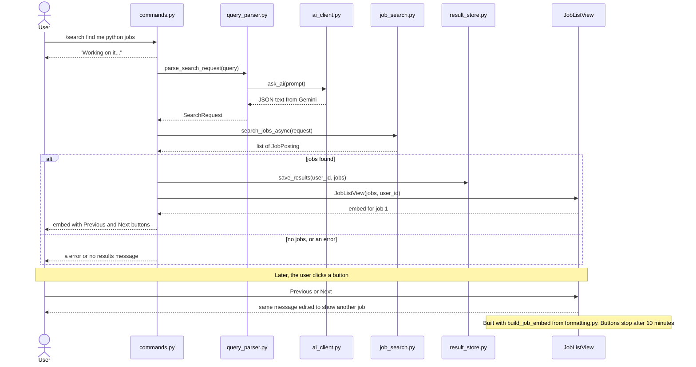
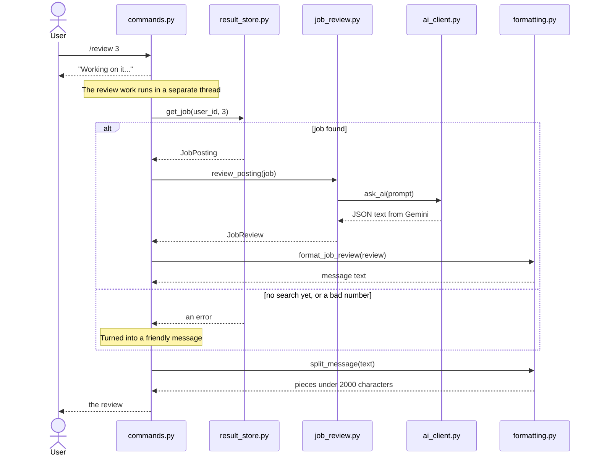

# Sequence Diagrams

## /search, then the Previous and Next buttons

```mermaid
sequenceDiagram
  Actor U as User
  participant C as commands.py
  participant QP as query_parser.py
  participant AI as ai_client.py
  participant JS as job_search.py
  participant RS as result_store.py
  participant V as JobListView
  U->>C: /search find me python jobs
  C-->>U: "Working on it..."
  C->>QP: parse_search_request(query)
  QP->>AI: ask_ai(prompt)
  AI-->>QP: JSON text from Gemini
  QP-->>C: SearchRequest
  C->>JS: search_jobs_async(request)
  JS-->>C: list of JobPosting
  alt jobs found
    C->>RS: save_results(user_id, jobs)
    C->>V: JobListView(jobs, user_id)
    V-->>C: embed for job 1
    C-->>U: embed with Previous and Next buttons
  else no jobs, or an error
    C-->>U: a error or no results message
  end
  Note over U,V: Later, the user clicks a button
  U->>V: Previous or Next
  V-->>U: same message edited to show another job
  Note over V: Built with build_job_embed from formatting.py. Buttons stop after 10 minutes
```

## /review

```mermaid
sequenceDiagram
  Actor U as User
  participant C as commands.py
  participant RS as result_store.py
  participant JR as job_review.py
  participant AI as ai_client.py
  participant F as formatting.py
  U->>C: /review 3
  C-->>U: "Working on it..."
  Note over C: The review work runs in a separate thread
  C->>RS: get_job(user_id, 3)
  alt job found
    RS-->>C: JobPosting
    C->>JR: review_posting(job)
    JR->>AI: ask_ai(prompt)
    AI-->>JR: JSON text from Gemini
    JR-->>C: JobReview
    C->>F: format_job_review(review)
    F-->>C: message text
  else no search yet, or a bad number
    RS-->>C: an error
    Note over C: Turned into a friendly message
  end
  C->>F: split_message(text)
  F-->>C: pieces under 2000 characters
  C-->>U: the review
```